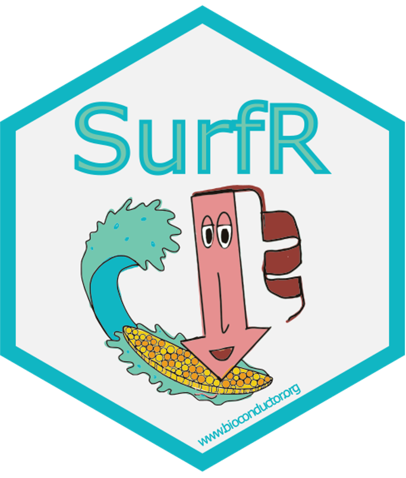

# SurfR Cholangiocarcinoma
## SurfR Bioconductor package cancer use case R code.

### Re-analysis of:
- GSE107943 bulk RNA-Seq dataset
- TCGA.CHOL dataset

### References

The Cancer Genome Atlas Research Network., Weinstein, J., Collisson, E. et al. 
The Cancer Genome Atlas Pan-Cancer analysis project. Nat Genet , 2013, 45:1113–1120.

Ahn KS, Kang KJ, Kim YH, Kim TS et al. 
Genetic features associated with (18)F-FDG uptake in intrahepatic cholangiocarcinoma. 
Ann Surg Treat Res 2019 Apr;96(4):153-161
